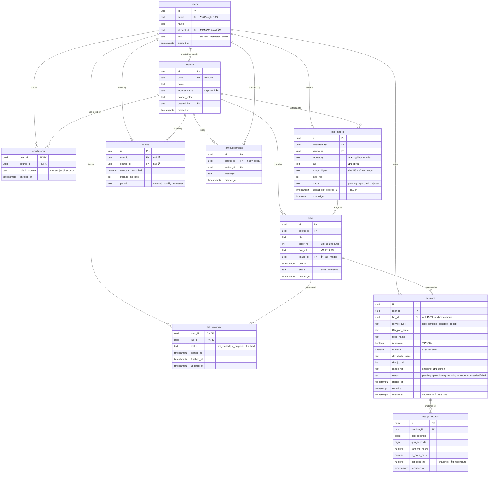

# Virtual Lab — Database Diagram

> ER diagram ของ schema v2 (PostgreSQL 17 — จะ implement ด้วย SQLAlchemy 2.0 + Alembic)

## อ่าน diagram ยังไง

- `||--o{` = one-to-many (ซ้าย 1 ตัว มีขวาได้หลายตัว)
- `PK` / `FK` / `UK` = primary key / foreign key / unique
- ป้ายกำกับหลังชนิดข้อมูล = ค่าที่เป็นไปได้หรือหมายเหตุสั้น ๆ

## Highlight

- **`sessions` ตารางเดียว** ครอบทุก workload (lab / compute / sandbox / AI job) — แยกประเภทด้วย `service_type`, มี `sky_cluster_name`/`sky_job_id` ผูกกับ SkyPilot
- **`lab_progress` แยกจาก `sessions`** — จบแลปเป็น learning fact ใช้กี่ session ก็ได้
- **`usage_records` เป็น Phase 2** — ตอนนี้ quota คิดจากเวลาเปิด–ปิด session
- **image อ้างด้วย `repository` + `tag`** ไม่ฝัง registry host (Tailscale IP เปลี่ยนได้)
