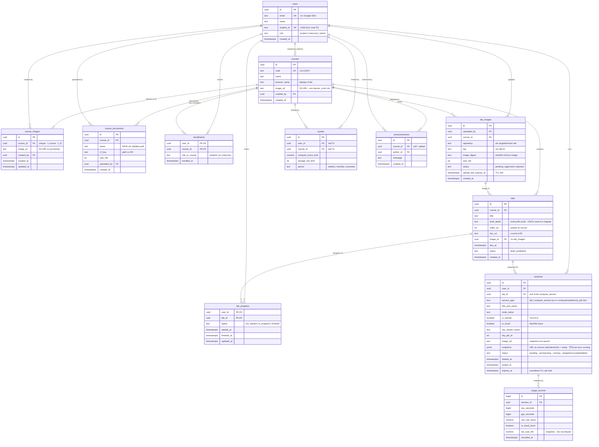

# Virtual Lab — Database Diagram

> ER diagram ของ schema v2 (PostgreSQL 17 — จะ implement ด้วย SQLAlchemy 2.0 + Alembic)


```mermaid
erDiagram
  users {
    uuid id PK
    text email UK "จาก Google SSO"
    text name
    text student_id UK "รหัสนักศึกษา (null ได้)"
    text role "student | instructor | admin"
    timestamptz created_at
  }

  courses {
    uuid id PK
    text code UK "เช่น CS217"
    text name
    text lecturer_name "display เท่านั้น"
    text image_url "S3 URL - แทน banner_color เดิม"
    uuid created_by FK
    timestamptz created_at
  }

  course_images {
    uuid id PK
    uuid course_id FK "unique - 1 course : 1 รูป"
    text image_url "S3 URL ของรูป banner"
    uuid created_by FK
    timestamptz created_at
    timestamptz updated_at
  }

  course_documents {
    uuid id PK
    uuid course_id FK
    text name "ชื่อไฟล์ เช่น Syllabus.pdf"
    text r2_key "path บน R2"
    int size_mb
    uuid uploaded_by FK
    timestamptz created_at
  }

  enrollments {
    uuid user_id PK, FK
    uuid course_id PK, FK
    text role_in_course "student | ta | instructor"
    timestamptz enrolled_at
  }

  labs {
    uuid id PK
    uuid course_id FK
    text title
    text brief_detail "คำอธิบายสั้น (null) - ยังไม่ใน main ต้อง migrate"
    int order_no "unique ต่อ course"
    text doc_url "เอกสารบน R2"
    uuid image_id FK "อ้าง lab_images"
    timestamptz due_at
    text status "draft | published"
    timestamptz created_at
  }

  lab_images {
    uuid id PK
    uuid uploaded_by FK
    uuid course_id FK
    text repository "เช่น skypilot/music-lab"
    text tag "เช่น lab-01"
    text image_digest "sha256 สำหรับลบ image"
    int size_mb
    text status "pending | approved | rejected"
    timestamptz upload_link_expires_at "TTL 24h"
    timestamptz created_at
  }

  lab_progress {
    uuid user_id PK, FK
    uuid lab_id PK, FK
    text status "not_started | in_progress | finished"
    timestamptz started_at
    timestamptz finished_at
    timestamptz updated_at
  }

  sessions {
    uuid id PK
    uuid user_id FK
    uuid lab_id FK "null สำหรับ compute_service"
    text service_type "lab | compute_service (ยุบจาก compute/sandbox/ai_job เดิม)"
    text k8s_pod_name
    text node_name
    boolean is_remote "รันจากบ้าน"
    boolean is_cloud "SkyPilot burst"
    text sky_cluster_name
    int sky_job_id
    text image_ref "snapshot ตอน launch"
    jsonb endpoints "URL ต่อ service (ide/client/ssh) + ready - ใช้ได้เฉพาะตอน running"
    text status "pending - provisioning - running - stopped/succeeded/failed"
    timestamptz started_at
    timestamptz ended_at
    timestamptz expires_at "countdown ใน Lab Hub"
  }

  usage_records {
    bigint id PK
    uuid session_id FK
    bigint cpu_seconds
    bigint gpu_seconds
    numeric ram_mb_hours
    boolean is_cloud_burst
    numeric est_cost_thb "snapshot - ห้าม recompute"
    timestamptz recorded_at
  }

  quotas {
    uuid id PK
    uuid user_id FK "null ได้"
    uuid course_id FK "null ได้"
    numeric compute_hours_limit
    int storage_mb_limit
    text period "weekly | monthly | semester"
  }

  announcements {
    uuid id PK
    uuid course_id FK "null = global"
    uuid author_id FK
    text message
    timestamptz created_at
  }

  users ||--o{ enrollments : "enrolls"
  courses ||--o{ enrollments : "has members"
  users ||--o{ courses : "created by (admin)"
  courses ||--o| course_images : "banner (1:1)"
  users ||--o{ course_images : "created by"
  courses ||--o{ course_documents : "documents"
  users ||--o{ course_documents : "uploaded by"
  courses ||--o{ labs : "contains"
  lab_images ||--o{ labs : "image of"
  users ||--o{ lab_images : "uploads"
  courses ||--o{ lab_images : "attached to"
  users ||--o{ lab_progress : "tracks"
  labs ||--o{ lab_progress : "progress of"
  users ||--o{ sessions : "runs"
  labs ||--o{ sessions : "spawned for"
  sessions ||--o{ usage_records : "metered by"
  users ||--o{ quotas : "limited by"
  courses ||--o{ quotas : "limited by"
  courses ||--o{ announcements : "posts"
  users ||--o{ announcements : "authored by"
```

## อ่าน diagram ยังไง

- `||--o{` = one-to-many (ซ้าย 1 ตัว มีขวาได้หลายตัว)
- `PK` / `FK` / `UK` = primary key / foreign key / unique
- ป้ายกำกับหลังชนิดข้อมูล = ค่าที่เป็นไปได้หรือหมายเหตุสั้น ๆ

## Highlight

- **`sessions` ตารางเดียว** ครอบทุก workload — แยกประเภทด้วย `service_type` (`lab` / `compute_service`), มี `sky_cluster_name`/`sky_job_id` ผูกกับ SkyPilot
- **`lab_progress` แยกจาก `sessions`** — จบแลปเป็น learning fact ใช้กี่ session ก็ได้
- **`usage_records` บันทึกทุก session** — quota block เฉพาะ `compute_service`, คิดจาก `limit` เทียบ `SUM(usage)` ไม่ decrement (ดู Quota & Usage lifecycle ใน [must-read/API_spec.md](must-read/API_spec.md))
- **image อ้างด้วย `repository` + `tag`** ไม่ฝัง registry host (Tailscale IP เปลี่ยนได้)

## การเปลี่ยนแปลงจาก schema เดิม (sync 2026-07-23)

**มีบน `main` แล้ว** (โค้ด SQLAlchemy อัปไปแล้ว diagram ตามให้ตรง):
- `courses.banner_color` → `courses.image_url` (commit 3b519bf)
- เพิ่มตาราง `course_images` — 1 course : 1 รูป banner (S3 URL) (commit e81e6bb)

**ตกลงกันแล้ว แต่ยังไม่ migrate** (ต้องทำ Alembic migration + แก้ model):
- `labs.brief_detail TEXT NULL` — คำอธิบายสั้นต่อแลป (คอลัมน์ Brief detail หน้า S3)
- ตาราง `course_documents` — เอกสาร PDF ระดับวิชาที่อาจารย์อัป

## ⚠️ อ่านก่อน pull: schema เปลี่ยน ต้อง drop DB

**1. `sessions.service_type`** — ยุบจาก 4 ค่า (`lab/compute/sandbox/ai_job`) เหลือ 2 ค่า (`LAB`/`COMPUTE_SERVICE`)

**2. `users.password_hash`** — คอลัมน์ใหม่ (nullable) สำหรับ login ด้วย student_id/email
seed จะตั้งรหัสเริ่มต้นให้ user ตัวอย่างทุกคนเป็น `labpass123`
ปล่อย nullable ไว้เพราะวันที่ย้ายไป SSO user ที่สร้างจาก SSO จะไม่มีรหัสผ่าน

**ใครที่มี DB อยู่ในเครื่องแล้วต้อง drop ทิ้งแล้วสร้างใหม่** ไม่งั้นจะ error ตอน
insert session เพราะค่าเก่ายังค้างอยู่ใน enum type ของ Postgres — ต่างจากการเพิ่ม
คอลัมน์ตรงที่ **Postgres ลบค่าออกจาก enum ที่มีอยู่แล้วไม่ได้** ต้องสร้าง type ใหม่
ซึ่งตอนนี้ยังไม่มี Alembic เลยใช้วิธี drop แล้ว seed ใหม่ (ข้อมูลเป็น seed ทั้งหมด
ไม่มีของจริงให้เสียหาย)

```bash
docker exec virtual_lab_db psql -U postgres -c "DROP DATABASE virtual_lab;" -c "CREATE DATABASE virtual_lab;"

cd web-portal/backend
PYTHONIOENCODING=utf-8 python script/init_db.py
PYTHONIOENCODING=utf-8 python script/run_seed.py
```

> `PYTHONIOENCODING=utf-8` จำเป็นบน Windows — สคริปต์ print emoji แล้ว console
> codepage ไทย (cp874) encode ไม่ได้ จะตายตั้งแต่บรรทัดแรกก่อนสร้างตารางด้วยซ้ำ
